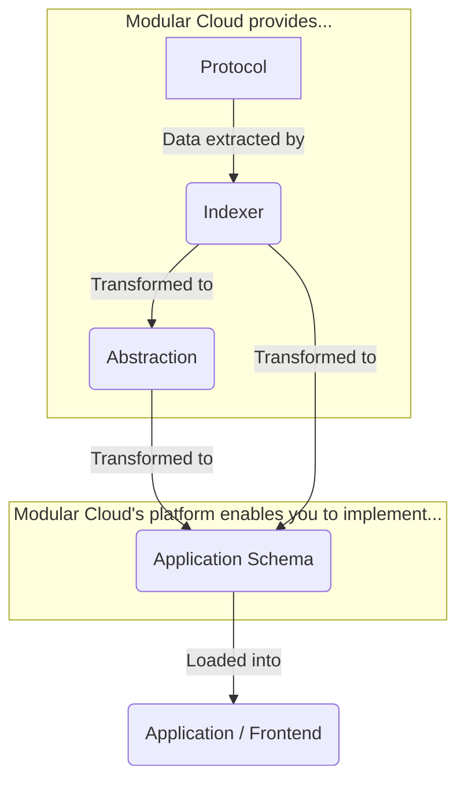
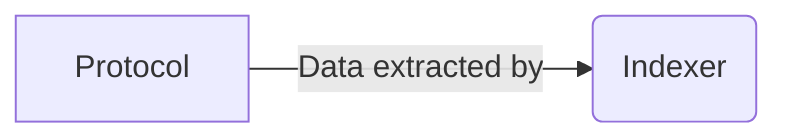
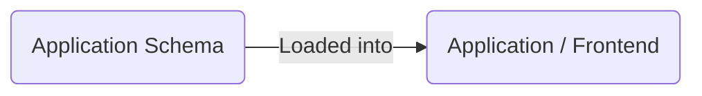
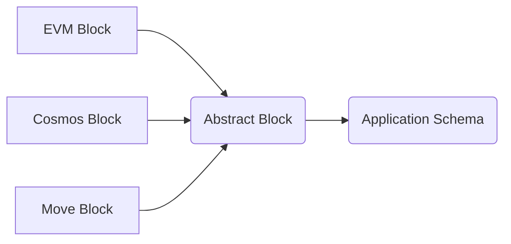
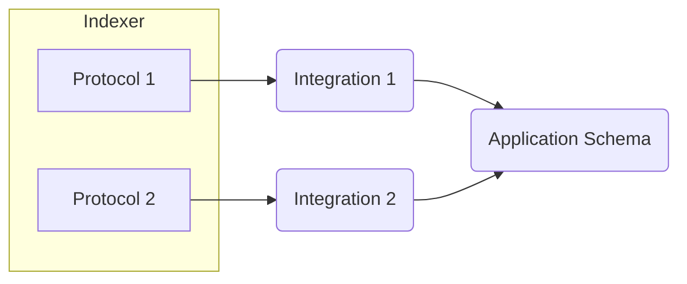
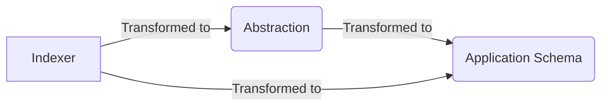
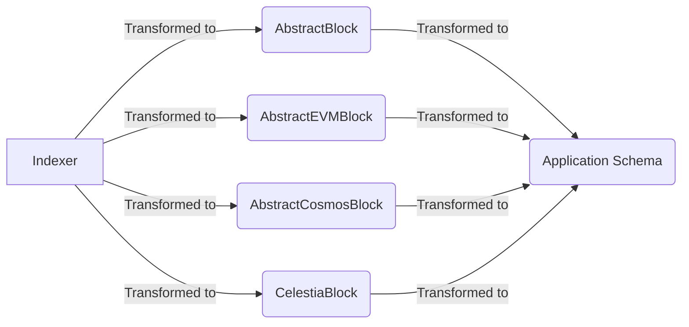

Building apps for modular blockchains can be challenging due the variation in each individual chain. Forgetting about the modular architecture (i.e. splitting execution, DA, and settlement) for a second, the new multi-chain era comes with its own problems.

For example:
- Not all chains are EVM
- Not all EVMs are equivalent
- Even equivalent VMs may be configured differently (such as having different TPS)

All of these things can break the assumptions that we make when we build apps. And, therefore, we want to build apps that abstract all of them away. I will walk through several patterns that we can use to do this.

# The easy way
Step 1. Build AGI.
Step 2. Have AGI create an integration for each chain.

Unfortunately, most teams don't have enough GPUs to do this. So we must go with the other solution.

# The hard way
The reality is that each chain must be integrated individually, because of our first tenet:

> **Tenet 1:** We cannot make common assumptions about all protocols.

Therefore, our strategies revolve around reducing the impact of needing to build these integrations. How can we make this process as easy as possible?

## Big picture

Modular Cloud completely handles the indexing process, and all of the intricacies that come along with it. When building an app, you should not have to think about such low-level problems. Instead, you should focus on building your application logic.

Therefore, you can leave it up to the protocol teams that work closely with Modular Cloud to implement this first part of the flow.


You should instead focus on the last part of the flow.


In order to do this, you should ask yourself two questions.
1. What data is needed to provide users with a great UX?
2. What format should that data be in so that developers can have a great DX?
The data needed by your users in a format that works for developers is what you call the **Application Schema**.

Your job is to take the data provided by Modular Cloud and transform it into your application schema, using a [Backend-for-Frontend (BFF)](https://samnewman.io/patterns/architectural/bff/) architecture. So, let's explore some patterns for how to do this and also see how Modular Cloud's service offering can help.

# Concepts and Patterns
## Abstractions
Most programmers building multichain applications will try to think in abstractions. So for example, they will try to create an `AbstractBlock` parent class from which `EVMBlock`, `CosmosBlock`, `MoveBlock`, etc. inherit.

Then, they will convert blocks from each blockchain into that `AbstarctBlock` superclass and build their applications to utilize this common representation instead of each individual block schema.


### Downsides
This approach has a major downside. There is a tradeoff between complexity and expressiveness (for lack of a better term).

**Here are some examples.**
1. Cosmos blocks have a `ChainID` in their block header. EVM blocks typically do not. Therefore, an `AbstractBlock` would either need an *optional* `ChainID` field (which introduces complexity to the application depending on this class), or it would need to omit the field entirely (which would be a less useful way to represent block data—since applications would not have access to `ChainID` information).
2. Sometimes there are common concepts that can be mapped to the same field, such as the `AppHash` in Cosmos and `StateRoot` on the EVM. However, these fields are not exactly equivalent and must be used in different ways. Cosmos stores state as an IAVL tree whereas the EVM uses a Patricia Tree.

Given that the goal of this architecture is to reduce the complexity of implementing different chains, it is our recommendation that an abstraction should err on the side of omitting information that cannot be generalized across protocols. Therefore, apps building on abstractions will have less capabilities than those that do not.

### Benefits
If you *can* rely on abstraction, then you *should*. Because this is the easiest and most scalable way to work with multiple chains.

This works particularly well when network effects accumulate behind a given abstraction. For example, if many different apps use the same abstraction, then protocols will be incentivized to build the transformations themselves.

**Here is a hypothetical example:**
- Imagine there is an abstraction called `AbstractBlock`.
- 10 different apps utilize this abstraction (such as a block explorer, on-chain monitoring service, social network, etc.)
- A new team creates a unique protocol or VM.
- They want compatibility with these 10 apps, so they using Modular Cloud to index their protocol and map their new block schema to the `AbstractBlock` type.
- Now, all 10 apps will automatically have full support for this new protocol as well.
- The developers who built the 10 apps had to do ***no additional work***—but their app automatically became more powerful.

## Entities
If abstractions are too much of an oversimplification for your application, then you will want to use something similar to the [Entity-Component System (ECS)](https://t-machine.org/index.php/2007/09/03/entity-systems-are-the-future-of-mmog-development-part-1/) architecture. This is most commonly used in games, when it is necessary to deal with thousands of different unique game objects (which is similar to dealing with thousands of different blockchain data types).

### Simplified version
There is a simple way to think about this, which is likely sufficient in most cases.

**Use the UI as the abstraction.** 

Here is an example from [Modular Cloud's block explorer](https://github.com/modularcloud/explorer).
![[explorer-arch.png]]
As you can see the raw blocks are not transformed into an `AbstractBlock`, but instead directly formatted for the UI.

On the sidebar, `ZBC` is the the balance of a token held by this wallet. If this user had other tokens, they would be reflected here too. However, this section is not called `balances`. Instead it is called `attributes` (which implies its a generic key/value data structure). This sidebar is reused for *non-balance data* at other times in the explorer.
![[Screenshot 2023-06-08 at 8.06.33 AM.png]]
Here it is displaying metadata for block `16388443`.

#### Why is this a good pattern?
> **Tenet 2:** Compared to a monolithic architecture, a modular blockchain architecture will contain a very large number of different data types.

Keeping track of all the different data types in the UI will quickly cause complexity in the core application. For example,

**Sidebar.jsx**
```javascript
if(block) {
	setSidebarContent(block.header)
}
if(address) {
	setSidebarContent(getBalances(address))
}
// ...
```

**Table.jsx**
```javascript
if(block) {
	setTableContent(block.transactions)
}
if(address) {
	setSidebarContent(getTransactions(address))
}
// ...
```

As you add more data types, this gets increasingly complex across the application. Dealing with subtleties can make this even more difficult. For example, there may be different logic to display balances between EVM and Cosmos.

**Sidebar.jsx (revisited)**
```javascript
if(block) {
	setSidebarContent(block.header)
}
if(address) {
	if(block.type === "EVM") {
		setSidebarContent(
			fromWei(
				getBalances(address)
			)
		)
	}
	if(block.type === "Cosmos") {
		setSidebarContent(getBalances(address))
	}
}
// ...
```

Instead, you want to concentrate all of this conditional logic into an **Integration**. The application schema will be based solely on the needs of the UI. It is the integration which will take care of mapping the raw indexer data directly to the application schema (this is called **"Integration Logic"**).



This simplifies the whole codebase in the following ways.
- Each integration maps the protocols schema to the application schema. There is no need to use complicated conditional logic because each protocol has its own integration.
- The UI is separated from integration logic as well. This allows UI developers to focus on the application, and not the semantics of the underlying protocols.
- Instead of adding complexity, you add more self-contained integrations. Each of which maps to an application schema that is controlled by the needs of the UI (and not based on a poorly generalized abstraction).

### Advanced version
This is being [actively developed](https://github.com/modularcloud/explorer/tree/main/packages/%40modularcloud/ecs) by Modular Cloud and should still be considered experimental.

We can break down an app into several pieces.

#### Entities
> An individual instance of an item, such as a block or transaction.

Everything is an entity. There are no classes or types. If you are building are use a block in your app, it is an entity. If you are using a transaction, it is an entity. There is **no such thing** as a `BlockEntity` or `TransactionEntity`.

#### Components
> Data associated with an entity. For example, a block with height 420 would be an `Entity` and it could have a `HeightComponent` with the value `420`.

Components are pure data. A given component can have an expected schema. Going back to our **Sidebar.jsx** example from before, we could have an `AttributesComponent`.
- In the case of viewing a block, data from the block header would be stored in the `AttributesComponent`.
- In the case of viewing an address, the token balances would be stored in the `AttributesComponent`.
- If an entity does not have attributes, then it's possible to have no `AttributesComponent` at all.

The implication is that the application using these entities would look for the `AttributesComponent` if it needed to access the "attributes". It would not contain any logic based on whether or not the type of the entity is "Block" or "Address".

#### Systems
> Code that does something for the user based on one or more entities.

Simply put, the UI is made up of a set of systems.

In Modular Cloud's explorer, the sidebar is a *React Component* (not to be confused with an *ECS component*) that operates as a system. Roughly speaking, it expects to receive an entity with an `AttributesComponent` (actually called a `SidebarComponent`). If such an entity is found, then it will display the info in the sidebar. If not, then it will display nothing.

This system knows nothing about blocks, transactions, or addresses. It just knows that if sidebar data is there, then it will display it.

When writing new integrations, the developer must decide what information is relevant to the sidebar, and should put it in that component.

## Hybrid
Going back to the middle part of the architecture.

It is possible to gain the benefits of abstractions while also following the creating direct entity integrations. The concept is to treat the abstraction itself as a the source of an integration.

For example, one could build a block explorer that uses `AbstractBlock` as the basic data structure for all block data (by converting it into an `Entity` with a `SidebarComponent` and more). This would give the developer of the block explorer access to *all the chains* utilizing the `AbstractBlock` abstraction.

Since an `AbstractBlock` might not contain all relevant information (such as Cosmos `ChainID`), an additional integration could be made specifically for Cosmos chains, while all non-Cosmos chains use `AbstractBlock`. This would allow their team to have broad compatibility while maintaining the flexibility of advanced, comprehensive integrations for the most important chains.

Here is an idealized visualization of the Modular Cloud's explorer architecture for rendering blocks.

All EVMs can be abstracted to a similar schema. All Cosmos chains can be abstracted to a similar schema. Celestia is Cosmos-inspired and compatible, but also doesn't perfectly fit in a true Cosmos abstraction. Any other protocol could be integrated through a generic block abstraction with minimal effort.

This provides the following benefits:
- EVM chains - **strong integration**
- Cosmos chains - **strong integration**
- Celestia - **very strong integration** (Celestia-specific customizations)
- All other chains - **weak integration** (missing depth, but basic features supported)

# FAQ
## What is the difference between the multichain and modular theses?
Without getting caught up in the details, the modular thesis implies that there will be higher level of variation across chains—any many more chains overall. A multichain thesis simply implies there will be more than one chain. While the actual number of chains, according to the multichain thesis, may be much higher than 1—it necessarily will be much lower than what is implied by the modular thesis.

## What is the 80/20 principle for building multichain/modular apps?
For now, supporting just EVM chains and Cosmos will cover a super majority of important projects.

## How hard is it to create an app that supports all EVM chains?
It is important to be aware of **EVM fragmentation**. This is something that web developers have faced for decades, while supporting different browsers (although interestingly, as a web developer myself, I don't think about this much anymore).

Here are some areas of fragmentation:
- Support for `debug` and `trace` RPC endpoints. In general, there are no clear standards around accessing internal transactions or state transitions. So it's best to avoid relying on them, if possible.
- Some EIPs are not supported across all chains. For example, [EIP-1559](https://eips.ethereum.org/EIPS/eip-1559) will cause transactions have slightly different fields across chains.
- Different chains can have different pre-deployed contracts. This must be taken into account if you are building contextualization systems depending on the contract deployment event.
- As mentioned earlier, not all EVM chains have Chain IDs.

## I don't like centralized cloud-based applications. Can this be decentralized?
Yes, this architecture does not depend on data coming from any specific source. This is about how you organize code while building your consumer application. Modular Cloud working to create decentralized solutions that support this long-term. However, keep in mind that there are certain benefits that the cloud provides which decentralized systems can never match. Each app must judge their needs on a case-by-case basis.

# Modular Cloud
Modular Cloud is here to help you build apps for multiple chains in the modular era.

**What we will be launching in the coming months**
- Indexing for any chain
- RPC endpoints and data retrieval APIs for any chain
- Custom transformations on data
- Custom API endpoints
- Execute arbitrary code after any on-chain event
- A block explorer capable of displaying data from any chain (helpful for devs)
- And best of all: **usage-based billing**
 
Usage-based billing is important because maintaining the infrastructure for every chain is not only difficult, but also *expensive.* Ideally, you can support thousands of chains but don't have to index and store trillions of blocks. If a user wants data from a given protocol, you should just be able to provide that data... without worrying about that ***entire chain***.

As the leaders in cloud infrastructure for this space, we are also developing tools that make this whole process easy.

If this interests you, [get in touch](mailto:lzrs@modular.cloud).
