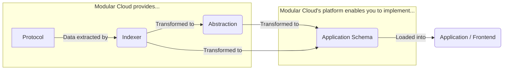
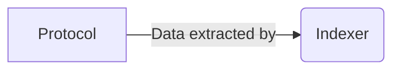
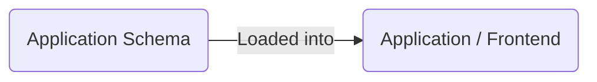
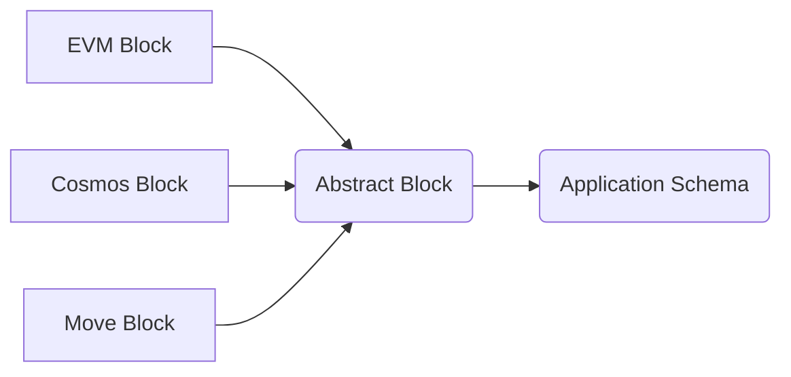

Building apps for modular blockchains can be challenging due the variation in each individual chain. Forgetting about the modular architecture (i.e. splitting execution, DA, and settlement) for a second, the new multi-chain era comes with its own problems.

For example:
- Not all chains are EVM
- Not all EVMs are equivalent
- Even equivalent VMs may be configured differently (such as having different TPS)

All of these things can break the assumptions that we make when we build apps. And, therefore, we want to build apps that abstract all of them away. I will walk through several patterns that we can use to do this.

# The easy way
Step 1. Build AGI.
Step 2. Have AGI create an integration for each chain.

Unfortunately, we are unable to do this with current technology. So we must go with the other solution.

# The hard way
The reality is that each chain must be integrated individually, because of our first tenet:

> **Tenet 1:** We cannot make common assumptions about all protocols.

Therefore, our strategies revolve around reducing the impact of needing to build these integrations. How can we make this process as easy as possible?

## Big picture

Modular Cloud completely handles the indexing process, and all of the intricacies that come along with it. When building an app, you should not have to think about such low-level problems. Instead, you should focus on building your application logic.

Therefore, you can leave it up to the protocol teams that work closely with Modular Cloud to implement this first part of the flow.

You should instead focus on the last part of the flow.

In order to do this, you should ask yourself two questions.
1. What data is needed to provide users with a great UX?
2. What format should that data be in so that developers can have a great DX?
The data needed by your users in a format that works for developers is what you call the **Application Schema**.

Your job is to take the data provided by Modular Cloud and transform it into your application schema, using a [Backend-for-Frontend (BFF)](https://samnewman.io/patterns/architectural/bff/) architecture. So, let's explore some patterns for how to do this and also see how Modular Cloud's service offering can help.

# Concepts and Patterns
## Abstractions
Most programmers building multichain applications will try to think in abstractions. So for example, they will try to create an `AbstractBlock` parent class from which `EVMBlock`, `CosmosBlock`, `MoveBlock`, etc. inherit.

Then, they will convert blocks from each blockchain into that `AbstarctBlock` superclass and build their applications to utilize this common representation instead of each individual block schema.

### Downsides
This approach has a major downside. There is a tradeoff between complexity and expressiveness (for lack of a better term).

**Here are some examples.**
1. Cosmos blocks have a `ChainID` in their block header. EVM blocks typically do not. Therefore, an `AbstractBlock` would either need an *optional* `ChainID` field (which introduces complexity to the application depending on this class), or it would need to omit the field entirely (which would be a less useful way to represent block data—since applications would not have access to `ChainID` information).
2. Sometimes there are common concepts that can be mapped to the same field, such as the `AppHash` in Cosmos and `StateRoot` on the EVM. However, these fields are not exactly equivalent and must be used in different ways. Cosmos stores state as an IAVL tree whereas the EVM uses a Patricia Tree.

Given that the goal of this architecture is to reduce the complexity of implementing different chains, it is our recommendation that an abstraction should err on the side of omitting information that cannot be generalized across protocols. Therefore, apps building on abstractions will have less capabilities than those that do not.

### Benefits
If you *can* rely on abstraction, then you *should*. Because this is the easiest and most scalable way to work with multiple chains.

This works particularly well when network effects accumulate behind a given abstraction. For example, if many different apps use the same abstraction, then protocols will be incentivized to build the transformations themselves.

**Here is a hypothetical example:**
- Imagine there is an abstraction called `AbstractBlock`.
- 10 different apps utilize this abstraction (such as a block explorer, on-chain monitoring service, social network, etc.)
- A new team creates a unique protocol or VM.
- They want compatibility with these 10 apps, so they using Modular Cloud to index their protocol and map their new block schema to the `AbstractBlock` type.
- Now, all 10 apps will automatically have full support for this new protocol
- The developers who built the 10 apps had to do ***no additional work***—but their app automatically got more powerful.

## Entities
If abstractions are too much of an oversimplification for your application, then you will want to use something similar to the [Entity-Component System (ECS)](https://t-machine.org/index.php/2007/09/03/entity-systems-are-the-future-of-mmog-development-part-1/) architecture. This is most commonly used in games, when it is necessary to deal with thousands of different unique game objects (which is similar to dealing with thousands of different blockchain data types).

### Simplified version
There is a simple way to think about this, which is likely sufficient in most cases.

Structure data based on how it appears in the UI, not based on what it means. In other words, ignore domain knowledge about the data.